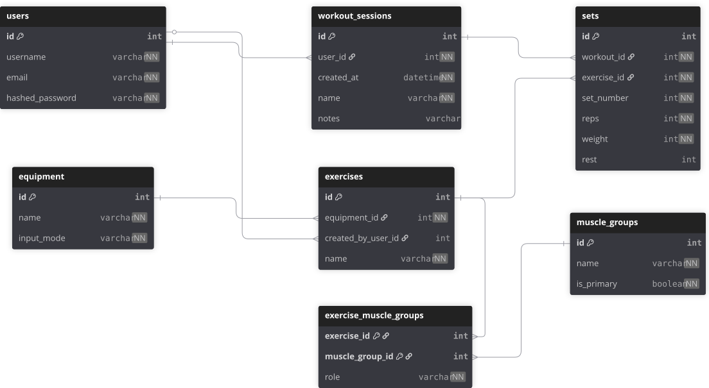

# Workout Tracker
A REST API workout tracker built with FastAPI and SQLAlchemy.

Built to practice backend development concepts including authentication, relational databases, dependency injection, and API testing.

Users can create workouts, log sets, and build custom exercises associated with equipment and muscle groups.

## Features

- JWT-based authentication
- User accounts with hashed passwords
###
- Input validation using Pydantic
- Custom validation and normalization functions
- Comprehensive pytest test suite
###
- Create and manage workout sessions
- Log exercises and sets within workouts
- Predefined and user-created exercises


## Tech Stack

Backend
 - Python
 - FastAPI

Database
 - SQLite (Development, Testing)

Authentication
 - OAuth2 with JWT
 - Hashing with pwdlib

Validation
 - Pydantic

Tools
 - Git
 - pytest


## API Endpoints

### Authentication

| Method | Endpoint | Description |
|--------|----------|-------------|
| POST | `/auth/login` | Authenticate user and return JWT token |

### Users

| Method | Endpoint | Description |
|--------|----------|-------------|
| GET | `/users/` | Get current authenticated user |
| POST | `/users/` | Create a new user |
| PUT | `/users/` | Update current user |
| DELETE | `/users/` | Delete current user |

### Equipment

| Method | Endpoint | Description |
|--------|----------|-------------|
| GET | `/equipment/` | Get all available equipment |
| GET | `/equipment/{equipment_id}` | Get specific equipment by ID |

### Exercises

| Method | Endpoint | Description |
|--------|----------|-------------|
| GET | `/exercises/` | Get exercises for current user (with optional `muscle_id` and `equipment_id` filters) |
| GET | `/exercises/{exercise_id}` | Get specific exercise |
| POST | `/exercises/` | Create a new exercise |
| PUT | `/exercises/{exercise_id}` | Update an exercise |
| DELETE | `/exercises/{exercise_id}` | Delete an exercise |

### Muscle Groups

| Method | Endpoint | Description |
|--------|----------|-------------|
| GET | `/muscles/` | Get all muscle groups |
| GET | `/muscles/{muscle_id}` | Get specific muscle group by ID |

### Sets

| Method | Endpoint | Description |
|--------|----------|-------------|
| GET | `/sets/{set_id}` | Get specific set |
| POST | `/sets/` | Create a new set |
| PUT | `/sets/{set_id}` | Update a set |
| DELETE | `/sets/{set_id}` | Delete a set |

### Workouts

| Method | Endpoint | Description |
|--------|----------|-------------|
| GET | `/workouts/` | Get all workouts for current user |
| GET | `/workouts/{workout_id}` | Get specific workout |
| POST | `/workouts/` | Create a new workout |
| PUT | `/workouts/{workout_id}` | Update a workout |
| DELETE | `/workouts/{workout_id}` | Delete a workout |

**Note:** Most endpoints require JWT authentication using the `Authorization: Bearer <token>` header.

## Example Request

```
POST /exercises

{
  "name": "Bench Press",
  "equipment_id": 1,
  "muscle_groups": [
    { "muscle_group_id": 1, "role": "primary" },
    { "muscle_group_id": 2, "role": "secondary" }
  ]
}
```

## Database Design

<p align="center">
  
</p>

## Installation

Clone the repository:

    git clone https://github.com/onhobson/workout-tracker
    cd workout-tracker

Create a virtual environment:

    python -m venv venv
    source venv/bin/activate

Install dependencies:

    pip install -r requirements.txt

Create a .env file in the project root with required environment variables.

Sample .env data:

    SECRET_KEY=31eb5d454345ea013fe98b714c6ac803e40111e1d652faa1e5443e6365a0c660
    ALGORITHM="HS256"
    ACCESS_TOKEN_EXPIRE_MINUTES=60

Feel free to replace `SECRET_KEY` with one of your choosing. This one isn't exactly secret anymore.

**Recommended**  
Seed the database with sample data using terminal command:

    python -m scripts.seed_db_all

## Running the API

Start the server:  

`uvicorn app.main:app`

Open the interactive docs:

`http://localhost:8000/docs`

## Running Tests

Tests use pytest and a separate, in memory, sqlite database.

In the terminal, run:

`pytest`

The test suite uses a starlette/FastAPI TestClient to mimic the main app and to override dependencies.  
Fixtures and factory patterns are used to create test data.


## Planned Features

 - Workout templates
 - Workout history
 - Email based password recovery
 - Frontend (React)
 - Analytics

 